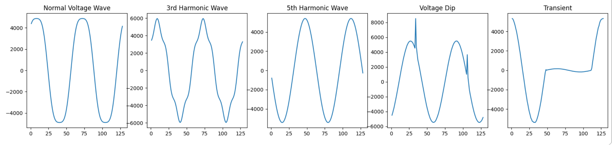
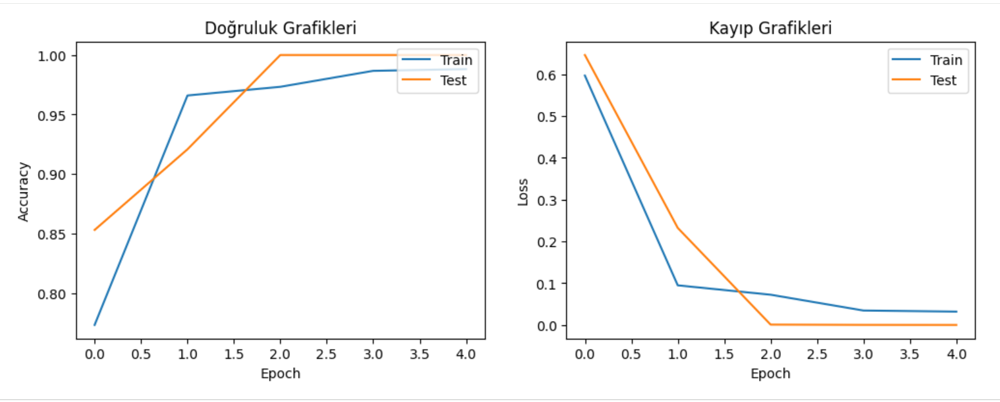
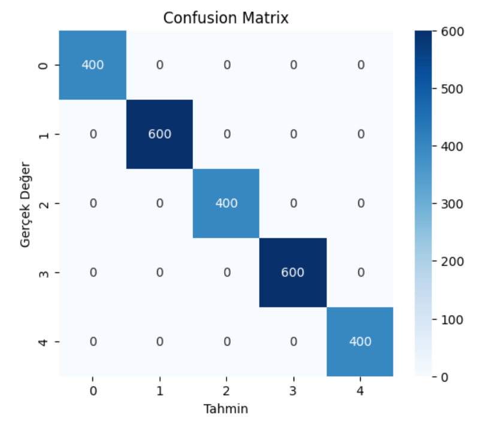

# Power Quality Disturbances Classification

Deep Learning-Based Power Quality Disturbances Classification

This project focuses on classifying power quality conditions from electrical voltage signals using a Convolutional Neural Network (CNN). Each signal consists of 128 time-domain data points and belongs to one of five power quality classes.

##### **Classes**

* Normal
* 3rd Harmonic Wave
* 5th Harmonic Wave
* Voltage Dip 
* Transient

##### **Model**

A Convolutional Neural Network (CNN) is used to learn patterns in the voltage signals and classify them into the five power quality conditions.

##### **Technologies**

* Python
* NumPy
* Panddas
* matplotlib
* Scikit-Learn
* TensorFlow

##### **Results**

The trained CNN achieved a test accuracy of 100%. No significant overfitting was observed during training, and the model successfully classified the test samples into their corresponding power quality classes.

